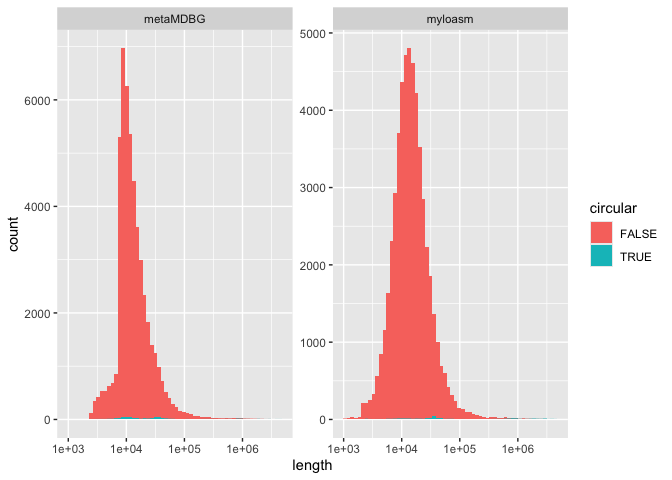
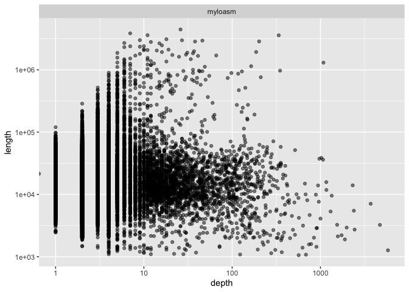
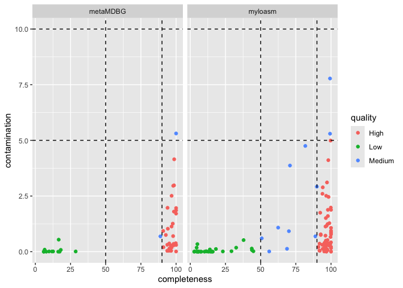
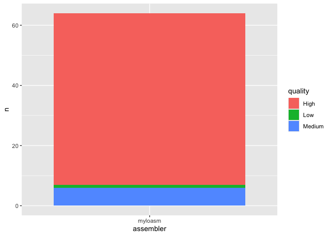
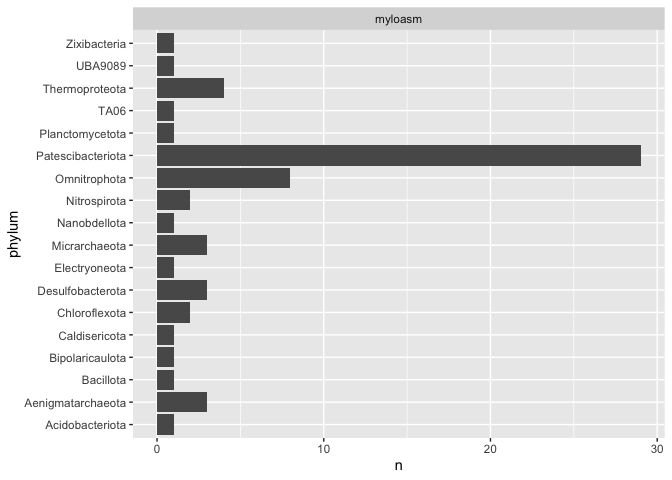

# Bioinformatics Data Processing - Final Assignment
Dajana Kolářová

## Overview

This report compares the performance of two metagenomic assemblers:
**myloasm** and **metaMDBG**. The evaluation is based on contig
statistics, CheckM2 quality assessment, and GTDB-Tk taxonomic
classification.

## Data Processing

``` r
library(tidyverse)
```

    ── Attaching core tidyverse packages ──────────────────────── tidyverse 2.0.0 ──
    ✔ dplyr     1.2.0     ✔ readr     2.2.0
    ✔ forcats   1.0.1     ✔ stringr   1.6.0
    ✔ ggplot2   4.0.2     ✔ tibble    3.3.1
    ✔ lubridate 1.9.5     ✔ tidyr     1.3.2
    ✔ purrr     1.2.1     
    ── Conflicts ────────────────────────────────────────── tidyverse_conflicts() ──
    ✖ dplyr::filter() masks stats::filter()
    ✖ dplyr::lag()    masks stats::lag()
    ℹ Use the conflicted package (<http://conflicted.r-lib.org/>) to force all conflicts to become errors

``` r
mylo_raw <- read_tsv("results/myloasm_assembly_headers.txt", col_names = c("header"), show_col_types = FALSE) %>%
  mutate(
    assembler = "myloasm",
    header = str_remove(header, "^>"),
    contig_id = str_extract(header, "^[^_]+"),
    length = as.numeric(str_extract(header, "(?<=len-)\\d+")),
    circular = if_else(str_extract(header, "(?<=circular-)[^_]+") %in% c("yes", "possible"), TRUE, FALSE),
    depth = as.numeric(str_extract(header, "(?<=depth-)\\d+"))
  ) %>% 
  select(assembler, contig_id, length, circular, depth)

mdbg_raw <- read_tsv("results/metamdbg_assembly_headers.txt", col_names = c("header"), show_col_types = FALSE) %>%
  mutate(
    assembler = "metaMDBG",
    header = str_remove(header, "^>"),
    contig_id = str_extract(header, "^[^ ]+"),
    length = as.numeric(str_extract(header, "(?<=length=)\\d+")),
    circular = str_detect(header, "circular=true"),
    depth = as.numeric(str_extract(header, "(?<=depth=)[0-9.]+"))
  ) %>% 
  select(assembler, contig_id, length, circular, depth)

contigs <- bind_rows(mylo_raw, mdbg_raw)


checkm_mylo <- read_tsv("results/checkm2/myloasm/quality_report.tsv", show_col_types = FALSE) %>%
  mutate(assembler = "myloasm")

checkm_mdbg <- read_tsv("results/checkm2/metamdbg/quality_report.tsv", show_col_types = FALSE) %>%
  mutate(assembler = "metaMDBG")

checkm2_clean <- bind_rows(checkm_mylo, checkm_mdbg) %>%
  transmute(
    contig_id = Name, 
    completeness = Completeness,
    contamination = Contamination,
    assembler,
    quality = case_when(
      completeness > 90 & contamination < 5 ~ "High",
      completeness > 50 & contamination < 10 ~ "Medium",
      TRUE ~ "Low"
    )
  )


gtdb_mylo <- bind_rows(
  read_tsv("results/gtdbtk/myloasm/classify/gtdbtk.bac120.summary.tsv", show_col_types = FALSE) %>% select(user_genome, classification),
  read_tsv("results/gtdbtk/myloasm/classify/gtdbtk.ar53.summary.tsv", show_col_types = FALSE) %>% select(user_genome, classification)
) %>% mutate(assembler = "myloasm")

gtdb_mdbg <- bind_rows(
  read_tsv("results/gtdbtk/metamdbg/classify/gtdbtk.bac120.summary.tsv", show_col_types = FALSE) %>% select(user_genome, classification),
  read_tsv("results/gtdbtk/metamdbg/classify/gtdbtk.ar53.summary.tsv", show_col_types = FALSE) %>% select(user_genome, classification)
) %>% mutate(assembler = "metaMDBG")

gtdb_clean <- bind_rows(gtdb_mylo, gtdb_mdbg) %>%
  transmute(
    contig_id = user_genome, 
    classification,
    phylum = str_extract(classification, "p__[^;]+") %>% str_remove("p__"),
    assembler
  ) %>%
  filter(!is.na(phylum)) %>%
  filter(!str_detect(classification, "Unclassified"))


final <- contigs %>%
  left_join(checkm2_clean, by = c("contig_id", "assembler")) %>%
  left_join(gtdb_clean, by = c("contig_id", "assembler"))

print(final %>% count(assembler))
```

    # A tibble: 2 × 2
      assembler     n
      <chr>     <int>
    1 metaMDBG  50109
    2 myloasm   53010

``` r
print(final %>% summarise(n_na_checkm = sum(is.na(completeness))))
```

    # A tibble: 1 × 1
      n_na_checkm
            <int>
    1      102968

``` r
print(final %>% summarise(n_na_gtdb = sum(is.na(phylum))))
```

    # A tibble: 1 × 1
      n_na_gtdb
          <int>
    1    102989

``` r
dir.create("figures", showWarnings = FALSE)

p1 <- final %>%
  ggplot(aes(x = length, fill = circular)) +
  geom_histogram(bins = 60) +
  facet_wrap(~ assembler, scales = "free_y") +
  scale_x_log10()
p1
```



``` r
p2 <- final %>%
  filter(!is.na(depth)) %>%
  ggplot(aes(x = depth, y = length)) +
  geom_point(alpha = 0.5) +
  facet_wrap(~ assembler) +
  scale_x_log10() +
  scale_y_log10()
p2
```


``` r
p3 <- final %>%
  filter(!is.na(completeness)) %>%
  ggplot(aes(x = completeness, y = contamination, color = quality)) +
  geom_point() +
  facet_wrap(~ assembler) +
  geom_vline(xintercept = c(50, 90), linetype = "dashed") +
  geom_hline(yintercept = c(10, 5), linetype = "dashed")
p3
```



``` r
p4 <- final %>%
  filter(circular == TRUE, length > 500000) %>%
  count(assembler, quality) %>%
  ggplot(aes(x = assembler, y = n, fill = quality)) +
  geom_col()
p4
```



``` r
p5 <- final %>%
  filter(circular == TRUE, length > 500000, !is.na(phylum)) %>%
  count(assembler, phylum) %>%
  ggplot(aes(x = phylum, y = n)) +
  geom_col() +
  facet_wrap(~ assembler, scales = "free_y") +
  coord_flip()
p5
```



``` r
final %>%
  filter(circular == TRUE, length > 500000) %>%
  count(assembler, quality)
```

    # A tibble: 3 × 3
      assembler quality     n
      <chr>     <chr>   <int>
    1 myloasm   High       57
    2 myloasm   Low         1
    3 myloasm   Medium      6

``` r
final %>%
  filter(circular == TRUE, length > 500000) %>%
  count(assembler, phylum, sort = TRUE)
```

    # A tibble: 18 × 3
       assembler phylum                n
       <chr>     <chr>             <int>
     1 myloasm   Patescibacteriota    29
     2 myloasm   Omnitrophota          8
     3 myloasm   Thermoproteota        4
     4 myloasm   Aenigmatarchaeota     3
     5 myloasm   Desulfobacterota      3
     6 myloasm   Micrarchaeota         3
     7 myloasm   Chloroflexota         2
     8 myloasm   Nitrospirota          2
     9 myloasm   Acidobacteriota       1
    10 myloasm   Bacillota             1
    11 myloasm   Bipolaricaulota       1
    12 myloasm   Caldisericota         1
    13 myloasm   Electryoneota         1
    14 myloasm   Nanobdellota          1
    15 myloasm   Planctomycetota       1
    16 myloasm   TA06                  1
    17 myloasm   UBA9089               1
    18 myloasm   Zixibacteria          1

## Conclusion

Based on the generated plots and the final summary tables, we can
evaluate which assembler performed better.

**Myloasm** produced 57 large circular contigs of High quality, while
**metaMDBG** produced 0 High quality contigs.

Overall, **myloasm** performed significantly better for this dataset. It
successfully reconstructed a total of 64 large circular contigs (\>500
kb), out of which 57 were of High quality and 6 of Medium quality.
Furthermore, myloasm was able to capture a wide taxonomic diversity,
reconstructing genomes from 18 different phyla (most notably
Patescibacteriota). In contrast, metaMDBG failed to reconstruct any
large circular contigs that would meet these criteria.
